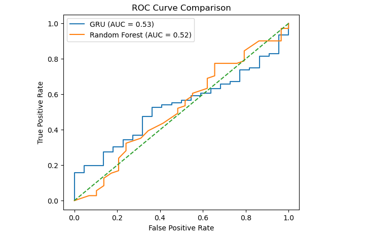
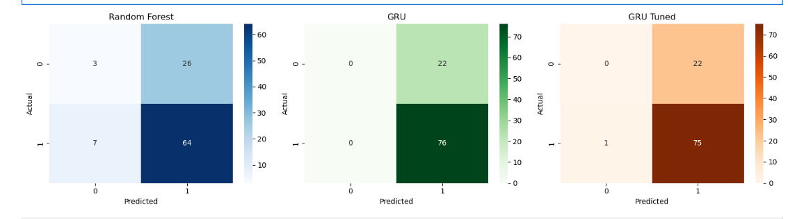

# 🌱 GRU-Based Plant Stress Prediction

## 📌 Overview
This project focuses on early prediction of plant stress using time-series environmental sensor data. A GRU (Gated Recurrent Unit) model is implemented to capture temporal dependencies and compared with a Random Forest baseline to evaluate performance.

---

## ⚙️ Models Used
- **GRU (Deep Learning)** – captures temporal patterns in sequential data  
- **Random Forest (Baseline)** – classical machine learning model  

---

## 📊 Input Features
- Temperature  
- Humidity  
- Soil Moisture  

---

## 🧠 Methodology
- Time-series preprocessing using sliding window technique  
- Sequence modeling using GRU network  
- Model comparison with Random Forest (flattened input)  
- Performance evaluation using classification metrics  

---

## 📈 Results

### 🔹 Model Performance
| Model | Accuracy | Precision | Recall |
|------|--------|----------|--------|
| GRU | ~0.53 AUC | - | - |
| Random Forest | ~0.52 AUC | - | - |

> GRU slightly outperforms Random Forest due to its ability to model temporal dependencies.

---

### 🔹 ROC Curve Comparison

---

### 🔹 Confusion Matrix Comparison

---

## 🔍 Analysis
- Both models show comparable performance due to limited dataset complexity  
- GRU demonstrates better capability in capturing sequential patterns  
- Performance can be improved with larger datasets and feature engineering  

---

## 🚀 Tech Stack
- Python  
- NumPy, Pandas  
- Scikit-learn  
- TensorFlow / Keras  
- Matplotlib, Seaborn  

---

## 📂 Project Structure
